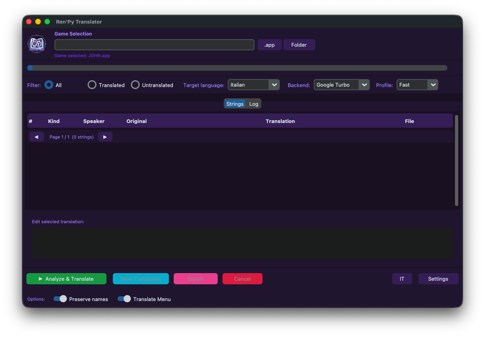

# 🌐 Ren'Py Translator

<p align="center">
  
</p>

<p align="center">
  <a href="README_it.md"></a>
</p>


> A universal GUI tool to automatically translate Ren'Py games — extracts scripts, detects dialogue and narration, and writes Ren'Py-compatible translation files (`tl/<lang>/`).

<p align="center">
  
</p>

---

## ✨ Features

| Feature | Description |
|---|---|
| 📦 **Auto Extraction** | Extracts `.rpa` archives and decompiles `.rpyc` files automatically |
| 🧠 **Smart Parsing** | Detects dialogue, narration, menu choices, and UI strings |
| 🌍 **Multiple Backends** | Google Turbo, Bing Turbo, OpenRouter, Llama Local |
| ⚡ **Bing Turbo** | Parallel session pools (3–6 workers) for up to 6x faster translation |
| 🔒 **Token Protection** | Preserves Ren'Py tags `{color=...}`, `[variable]`, etc. during translation |
| 📄 **Paginated Table** | Handles 10,000+ strings without freezing — 100 rows per page |
| 💾 **TL File Output** | Writes standard `game/tl/<lang>/` files compatible with Ren'Py |
| 🌐 **EN / IT UI** | Switch between English and Italian interface |
| 📝 **Inline Editor** | Click any row in the table to review and edit the machine translation before saving |

---

## 🚀 Quick Start

**macOS / Linux:**
```bash
./start.sh
```

**Windows:**
```bat
start.bat
```

Dependencies are installed automatically via `uv` on first launch.

---

## 🔧 Workflow

1. **Select Game** — `.app` (macOS) or game folder (Windows/Linux)
2. **Choose target language, backend and translation profile**
3. **Click Analyze & Translate** — extracts, decompiles, parses and translates the game
4. **Review & Edit** — click any row in the table to edit the machine translation
5. **Click Save Translation** — writes the reviewed translations to `game/tl/<lang>/` and installs the activator
6. **Export** (optional) — creates a distributable `GameName-<lang>/` folder with `game/tl/<lang>/` and activator, even without a previous Save

---

## 🌍 Translation Backends

| Backend | Speed | Requires |
|---|---|---|
| **Google Turbo** | Fast (12 mirrors, parallel, rate-limit resistant) | nothing (free) |
| **Bing Turbo** | Fast (parallel sessions) | nothing (free) |
| **OpenRouter** | Medium | API key at openrouter.ai |
| **Llama Local** | Slow | local `.gguf` model via llama_cpp |

---

## 🛡️ Translation Profiles

Choose a profile next to the backend selector for Google Turbo and Bing Turbo:

| Profile | Workers | Request pacing | Recommended use |
|---|---:|---|---|
| **Safe** | 2 | 350ms random delay | Long translations; lowest risk of rate limiting |
| **Balanced** | 4 | 120ms random delay | Default; speed and reliability |
| **Fast** | 6 | No added delay | Short jobs; higher risk of rate limiting |

Google Turbo always uses mirror health tracking, reusable HTTP sessions, adaptive pacing, and exponential backoff after rate-limit responses.

## 💾 Translation Cache

Completed translations are cached per language pair in `~/.cache/renpy-translator/`. Re-running a translation skips text already in the cache, reducing both runtime and requests to translation services.

---

## ⚙️ Options

| Option | Description |
|---|---|
| **Preserve names** | Skips single capitalized words (character names) |
| **Translate Menu** | Also translates menu choices and UI text elements |
| **Verbose log** | Logs every translated string (off by default for performance) |

---

## 📦 Manual Installation

```bash
pip install customtkinter pillow deep-translator requests
```

---

## 🎮 Using with WTForge

If you also use **[Ren'Py WTForge](https://github.com/huchukato/RenPy-WTForge)** to generate a walkthrough mod, always **translate first**, then generate the mod — so WTForge picks up the translated choice texts automatically.

---

## 🙏 Credits

- Tool by **[huchukato](https://f95zone.to/members/huchukato.11155677/)** (F95Zone)
- UnRen Tools by **huchukato, goobdoob, jimmy5 & Sam**
- rpatool by **[Shiz](https://codeberg.org/shiz/rpatool)**
- unrpyc by **[CensoredUsername](https://github.com/CensoredUsername/unrpyc)**
