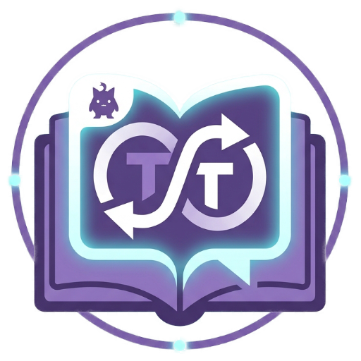

# 🌐 Ren'Py Translator

<p align="center">
  
</p>

<p align="center">
  <a href="README.md"></a>
</p>


> Uno strumento GUI universale per tradurre automaticamente i giochi Ren'Py — estrae gli script, rileva dialoghi e narrazione, e scrive i file di traduzione compatibili con Ren'Py (`tl/<lingua>/`).

---

## ✨ Funzionalità

| Funzione | Descrizione |
|---|---|
| 📦 **Estrazione automatica** | Estrae archivi `.rpa` e decompila file `.rpyc` automaticamente |
| 🧠 **Parsing intelligente** | Rileva dialoghi, narrazione, scelte di menu e testi UI |
| 🌍 **Più backend** | Google, Bing, Bing Turbo, Bing Ultra, LibreTranslate, OpenRouter, llama_cpp |
| ⚡ **Bing Turbo / Ultra** | Pool di sessioni parallele (3–6 worker) per traduzioni fino a 6× più veloci |
| 🔒 **Protezione token** | Preserva i tag Ren'Py `{color=...}`, `[variabile]`, ecc. durante la traduzione |
| 📄 **Tabella paginata** | Gestisce 10.000+ stringhe senza bloccarsi — 100 righe per pagina |
| 💾 **Output file TL** | Scrive file `game/tl/<lingua>/` standard compatibili con Ren'Py |
| 🌐 **Interfaccia IT / EN** | Passa dall'italiano all'inglese con un click |

---

## 🚀 Avvio rapido

**macOS / Linux:**
```bash
./start.sh
```

**Windows:**
```bat
start.bat
```

Le dipendenze vengono installate automaticamente tramite `uv` al primo avvio.

---

## 🔧 Flusso di lavoro

1. **Seleziona il gioco** — `.app` (macOS) o cartella del gioco (Windows/Linux)
2. **Analizza il gioco** — estrae `.rpa`, decompila `.rpyc`, scansiona tutti i file `.rpy`
3. **Scegli lingua target e backend**
4. **Traduci tutto** — traduce tutte le stringhe in background con avanzamento % in tempo reale
5. **Salva file TL** — scrive `game/tl/<lingua>/` direttamente nella cartella del gioco

---

## 🌍 Backend di traduzione

| Backend | Velocità | Requisiti |
|---|---|---|
| **google** | Veloce | nessuno (gratuito) |
| **bing** | Veloce | nessuno (gratuito) |
| **bing_turbo** | ~3× più veloce | nessuno (gratuito) |
| **bing_ultra** | ~6× più veloce | nessuno (gratuito) |
| **libre** | Medio | server LibreTranslate locale |
| **openrouter** | Medio | API key gratuita su openrouter.ai |
| **llama** | Lento | modello `.gguf` locale via llama_cpp |

---

## ⚙️ Opzioni

| Opzione | Descrizione |
|---|---|
| **Preserve names** | Salta le parole singole in maiuscolo (nomi dei personaggi) |
| **Translate UI** | Traduce anche le scelte di menu e i testi UI |
| **Verbose log** | Logga ogni stringa tradotta (disabilitato di default per le performance) |

---

## 📦 Installazione manuale

```bash
pip install customtkinter pillow deep-translator requests
```

---

## 🙏 Crediti

- Tool di **[huchukato](https://f95zone.to/members/huchukato.11155677/)** (F95Zone)
- UnRen Tools di **huchukato, goobdoob, jimmy5 & Sam**
- rpatool di **[Shiz](https://codeberg.org/shiz/rpatool)**
- unrpyc di **[CensoredUsername](https://github.com/CensoredUsername/unrpyc)**
